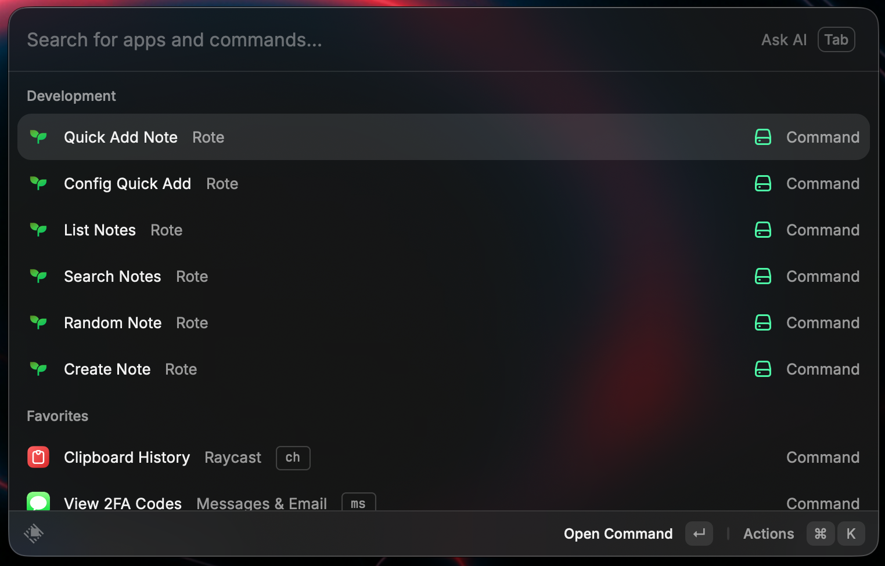
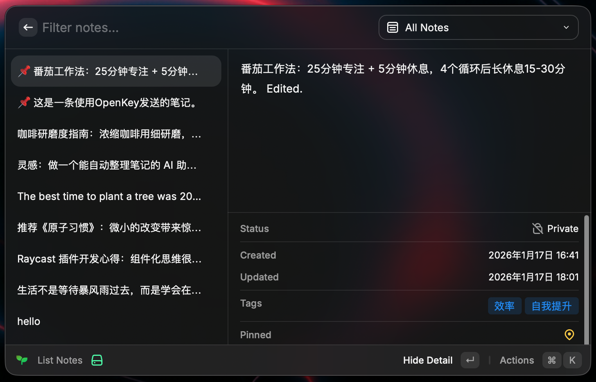
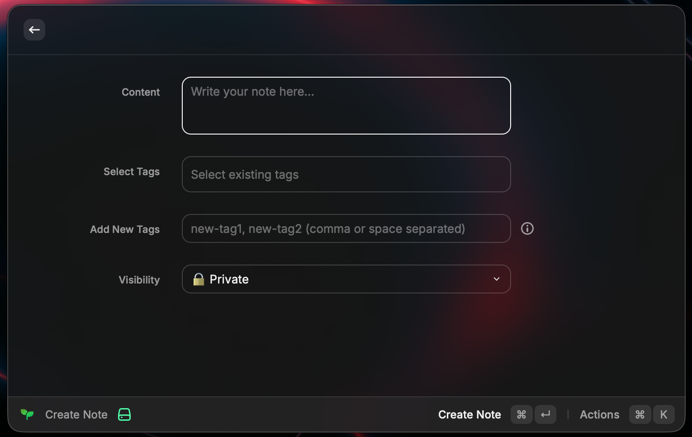
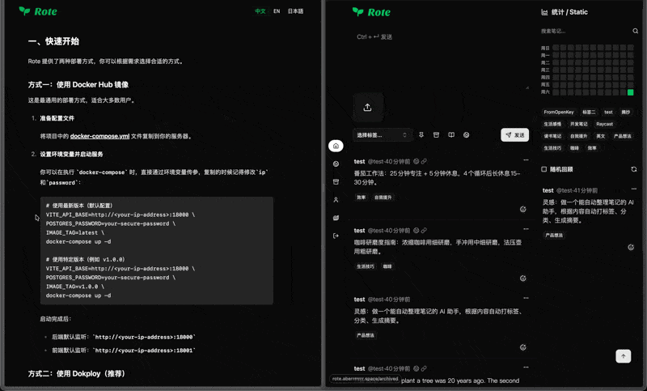
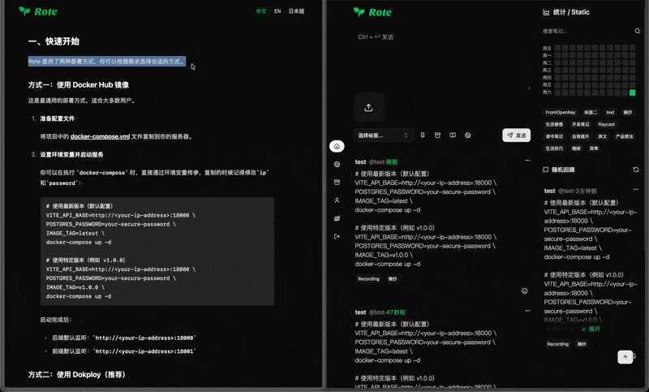
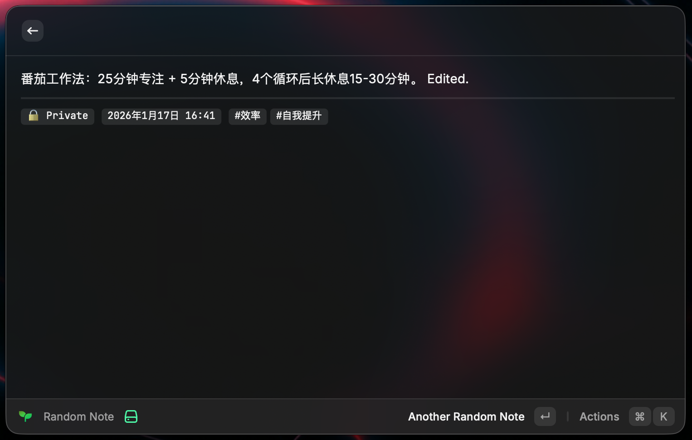

# Rote for Raycast

[English](./README.md)

一个用于 [Rote](https://github.com/Rabithua/Rote) 的 Raycast 扩展 - 快速创建、搜索和管理你的灵感笔记。

## 功能特性

- 🔍 **搜索笔记** - 全文搜索，带详情面板预览
- 📋 **笔记列表** - 按时间/状态/标签筛选浏览笔记
- 📝 **创建笔记** - 创建带标签和可见性设置的笔记
- ⚡ **快速添加** - 一键保存选中文字或剪贴板内容为笔记
- ⚙️ **配置快速添加** - 从已有标签中选择默认标签
- 🎲 **随机笔记** - 随机展示一条笔记进行回顾

## 功能截图

### 总览


### 笔记列表
浏览和管理笔记，支持强大的筛选功能。



### 创建笔记
创建带标签和可见性设置的笔记。



### 快速添加
一键保存选中文字或剪贴板内容为笔记。





### 配置快速添加
为快速添加命令配置默认标签。


### 随机笔记
随机展示一条笔记进行回顾。



## 安装

### 从源码安装

1. **克隆仓库**
```bash
git clone https://github.com/YOUR_USERNAME/rote-raycast.git
cd rote-raycast
```

2. **启用开发者模式**
   - 打开 Raycast
   - 按 `⌘ ,` 打开设置
   - 进入 `Advanced` (高级) 标签
   - 勾选 `Developer Mode` (开发者模式)

3. **导入插件**
   - 使用快捷键打开 Raycast
   - 输入 `Import Extension`
   - 选择插件所在的文件夹(包含 `package.json` 的目录)
   - 确认导入

4. **安装依赖**
   - 插件导入后,Raycast 会自动安装所需依赖
   - 如果需要手动安装,进入插件目录运行 `npm install`

### 开发模式

开发时使用热重载：

```bash
npm run dev
```

然后按照上述步骤将扩展导入到 Raycast。

## 配置

1. 安装扩展
2. 打开 Raycast 偏好设置 → 扩展 → Rote
3. 配置以下设置项：

| 设置项 | 必填 | 说明 |
|--------|------|------|
| **API Endpoint** | 是 | Rote 后端 API 地址（如 `https://rote-backend.example.com`） |
| **Web URL** | 否 | Rote 前端地址，用于在浏览器中打开笔记 |
| **Username** | 是 | Rote 用户名或邮箱 |
| **Password** | 是 | Rote 密码 |

> **提示：** 支持用户名和邮箱两种登录方式，扩展会自动识别。

## 命令说明

### 搜索笔记 (Search Notes)
实时搜索笔记，右侧详情面板显示完整内容、图片和元数据。

**快捷键：**
- `Cmd+O` - 在浏览器中打开
- `Cmd+C` - 复制内容
- `Cmd+Shift+C` - 复制链接
- `Cmd+Shift+V` - 粘贴内容

### 笔记列表 (List Notes)
浏览笔记，支持多种筛选方式：

**时间筛选：**
- 全部笔记
- 今天
- 昨天
- 最近 7 天
- 最近 30 天

**状态筛选：**
- 公开
- 私密
- 置顶

**标签筛选：**
- 按笔记中的任意标签筛选

**快捷键：**
- `Cmd+E` - 编辑笔记
- `Cmd+D` - 删除笔记
- `Cmd+O` - 在浏览器中打开
- `Cmd+C` - 复制内容
- `Cmd+Shift+C` - 复制链接
- `Cmd+Shift+V` - 粘贴内容
- `Cmd+R` - 刷新列表

### 创建笔记 (Create Note)
创建笔记，支持：
- 内容（支持 Markdown）
- 标签（逗号或空格分隔）
- 可见性（私密/公开）

### 快速添加 (Quick Add Note)
无界面命令，一键创建笔记：
1. 优先使用选中的文字
2. 其次使用剪贴板内容

推荐使用 **配置快速添加** 命令来设置默认标签。

### 配置快速添加 (Config Quick Add)
为快速添加设置默认标签：
- 从已有标签中浏览和选择
- 输入新标签名可直接创建
- 避免手误输入错误标签

### 随机笔记 (Random Note)
随机展示一条笔记。

**快捷键：**
- `Cmd+R` - 换一条随机笔记
- `Cmd+O` - 在浏览器中打开

## 开发

```bash
npm install      # 安装依赖
npm run dev      # 开发模式
npm run build    # 构建生产版本
npm run lint     # 代码检查
```

## 许可证

MIT
